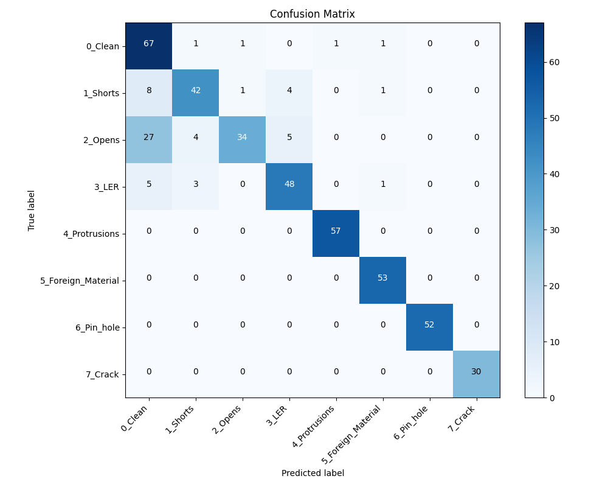

# Scale-Invariant: A DeepPCB-to-Wafer Framework (IESA Hackathon Edition)

This repository contains an end-to-end pipeline for processing the DeepPCB dataset, converting it into a classification dataset, augmenting underrepresented classes, and training a MobileNetV2-based classifier for detecting defects during semiconductor manufacturing.

Based on the original [DeepPCB](https://github.com/tangsanli5201/DeepPCB) dataset.

## 📂 Project Structure

```text
.
├── PCBData/                  # Original Raw Data (downloaded source)
├── IESA_Hackathon_Dataset/    # Intermediate sorted dataset (by class)
├── Final_Submission_Dataset/  # Final split dataset (Train/Val/Test)
├── model.onnx                # Trained model exported to ONNX
├── tools/                    # Annotation tools (Qt C++)
└── evaluation/               # Evaluation scripts
```

## 🚀 Workflow

To reproduce the dataset creation and model training, follow these steps in order:

### 1. Requirements
Ensure you have the necessary Python libraries installed:
```bash
pip install tensorflow scikit-learn pillow tf2onnx matplotlib
```

### 2. Sort and Organize Data
Run the sorting script to parse the original `PCBData` annotations and organize images into class-labeled folders. This maps original defect IDs to the Hackathon specific classes (e.g., Mousebite → LER).

```bash
python sort_dataset.py
```
> **Output**: Creates `IESA_Hackathon_Dataset/` with subfolders for each class.

### 3. Data Balancing & Augmentation
The dataset may be imbalanced (e.g., few cracks). Run the augmentation scripts to generate synthetic data or balance the classes.

**Augment Cracks:**
```bash
python augment_cracks.py
```
**Balance All Classes:**
```bash
python balance_data.py
```

### 4. Split Dataset
Split the organized data into Training, Validation, and Test sets.
```bash
python split_dataset.py
```
> **Output**: Creates `Final_Submission_Dataset/` with `Train/`, `Validation/`, and `Test/` subdirectories.

**Verify the split:**
You can check the distribution of images across sets using:
```bash
python verify_split.py
```

### 5. Train Model
Train the MobileNetV2 model using the processed dataset.
```bash
python train_model.py
```
*   Reference: `train_model.py`
*   **Model**: MobileNetV2 (Transfer Learning from ImageNet)
*   **Output**: Saves the trained model as `model.onnx`.

## 📊 Dataset Classes

The sorting script maps the original DeepPCB defect IDs to the following classes:

| ID | Original Name | Hackathon Name |
|----|---------------|----------------|
| 0  | Background    | 0_Clean        |
| 1  | Open          | 2_Opens        |
| 2  | Short         | 1_Shorts       |
| 3  | Mousebite     | 3_LER          |
| 4  | Spur          | 4_Protrusions  |
| 5  | Copper        | 5_Foreign_Material |
| 6  | Pin-hole      | 6_Pin_hole     |
| 7  | -             | 7_Crack (Augmented) |

## 📊 Dataset Classes & Statistics

The sorting script maps the original DeepPCB defect IDs to the Hackathon classes.  
The final dataset distribution is as follows:

| Class | Train | Val | Test | Total |
|------|------:|----:|-----:|------:|
| 0_Clean | 234 | 69 | 71 | 374 |
| 1_Shorts | 184 | 56 | 56 | 296 |
| 2_Opens | 222 | 69 | 70 | 361 |
| 3_LER | 183 | 57 | 57 | 297 |
| 4_Protrusions | 188 | 58 | 57 | 303 |
| 5_Foreign_Material | 176 | 54 | 53 | 283 |
| 6_Pin_hole | 179 | 53 | 52 | 284 |
| 7_Crack | 140 | 30 | 30 | 200 |
| TOTAL | 1506 | 446 | 446 | 2398 |

## 📈 Classification Report

| Class | Precision | Recall | F1-Score | Support |
|------|----------:|-------:|---------:|--------:|
| 0_Clean | 0.89 | 0.92 | 0.90 | 71 |
| 1_Shorts | 0.82 | 0.88 | 0.84 | 56 |
| 2_Opens | 0.91 | 0.74 | 0.82 | 70 |
| 3_LER | 0.80 | 0.91 | 0.85 | 57 |
| 4_Protrusions | 1.00 | 1.00 | 1.00 | 57 |
| 5_Foreign_Material | 1.00 | 0.98 | 0.99 | 53 |
| 6_Pin_hole | 1.00 | 1.00 | 1.00 | 52 |
| 7_Crack | 1.00 | 1.00 | 1.00 | 30 |

| Metric | Precision | Recall | F1-Score | Support |
|-------|----------:|-------:|---------:|--------:|
| Accuracy |  |  | 0.92 | 446 |
| Macro Avg | 0.93 | 0.93 | 0.93 | 446 |
| Weighted Avg | 0.92 | 0.92 | 0.92 | 446 |

## 🧮 Convolution Matrix Representation



## 🛠 Tools

The `tools/` directory contains the original C++ Qt based `PCBAnnotationTool` for manually viewing or editing annotations.

## 📝 Evaluation

See `evaluation/` for scripts related to calculating mAP and F-score on the original localized detection task.

---
*Original DeepPCB README is archived as `README_original.md`*
